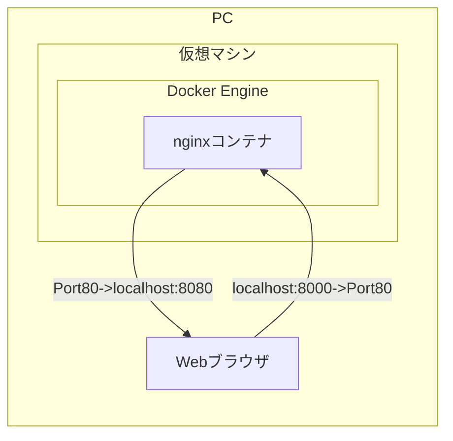

## Docker

```shell
$ docker run hello-world
```

DockerHubからdockerイメージを取得して、ローカルに保存。のちにdockerイメージからコンテナを起動するコマンド。

> `run`コマンドは`pull`、`create`、`start`をまとめたもの

 ```shell
$ docker run -it ubuntu bash
 ```

タグ指定の方法

```shell
$ docker run hello-world:latest
```


Dockerイメージは読み取り専用らしい

イメージは軽量に作成する

CentOSのベースイメージにルビーのレイヤーを加えるとか、そんな感じに継承してレイヤーを追加していく。


```shell
$ docker run docker/whalesay cowsay Hello!!
```

これで、持っているイメージの一覧が取得できる。

```shell
$ docker images
```

イメージに任意の名前をつけることができる。

aliasみたいなもの

```shell
$ docker tag docker/whalesay my_whalesay:ver1
```

詳細情報を表示する

```shell
$ docker inspect my_whalesay
```

イメージを削除する(コンテナは起動したまま？)

```shell
$ docker rmi docker/whalesay
$ docker rmi -f docker/whalesay
```

> 同じ中身のイメージを複数削除するときは、ID指定するといい。
>
> ```shell
> $ docker rmi -f 9f5550ca0c41
> ```

また取得する

```shell
$ docker pull docker/whalesay
```

## imageを作成する

```shell
$ docker build -t docker-whale .
```

カレントディレクトリに存在する`Dockerfile`から`docker-whale`という名前でイメージを作成する。

```dockerfile
FROM docker/whalesay:latest↲
RUN apt-get -y update; apt-get install -y fortunes↲
CMD /usr/games/fortune | cowsay↲
```

[docker/whalesay](https://hub.docker.com/r/docker/whalesay)は`ubuntu:14.04`をベースイメージとして作成されているため、`apt-get`が使えるというわけ。

```shell
$ doker build --no-cache -t docker-whale .
```

## imageをDockerHubにあげる

GitHubみたいにssh通信ではなく、最初にログインする。

```shell
$ docker login
```

`DockerHub`アカウントのレポジトリ名と同じイメージ名にする。

```shell
$ docker tag docker-whale sasakipeter/docker-whale:latest
```

そうすると、`push`コマンドで単純にイメージ名を引数にとってあげれば、`DockerHub`上にあげることができる。

```shell
$ docker push sasakipeter/docker-whale:ver1
```


> いまだによくわかっていないこと
>
> ```shell
> $ docker ps
> ```
>
> 上のコマンドで、コンテナの一覧が見られるらしい。
>
> そのコンテナは、imagesから`create`コマンドで作成できるはずなのに、なぜかうまくいかない。
>
> `run`コマンドでしか、コンテナを起動できないのが現状。

## Nginxを使ったWebサーバーの構築

```shell
$ docker run --name test-nginx -d -p 8080:80 nginx
```

> `-d`オプションはdetach
>
> screenコマンドで見るやつと同じで、バックグランドで実行するということ。
>
> つまり、`screen`してから`yarn start`するのと同じ感覚

`localhost:8080`にnginxのサーバーが立ち上がっている。仮想マシンの8080にアクセスすると、nginxコンテナの80に転送されるらしい。



だいたいこんな感じ。

```shell
$ docker stop test-nginx
$ docker rm test-nginx
```

コンテナはストップしたら、`docker ps`には表示されないけれども、コンテナは存在している状態になる。removeしないと、同名のコンテナは作成できない。

> COPY命令がうんたんのところにも書いたけど、`--rm`オプションを使うことによって、コンテナ停止と同時に、コンテナを削除することができるらしい。
>
> コンテナ一括削除
>
> ```shell
> $ docker rm `docker ps -aq`
> ```
>
> 

### バインドマウントを使用する

バインドマウント is なに？

自分のこのPC（ホスト）上のファイルと、仮想環境のLinuxの上に乗っかってるnginxをバインディングしてマウントしているってことやなきっと。

下のコマンドで`/usr/share/nginx/html`ってやって、バインド、すなわちファイルを転送しているけど、これは仮想環境上の場所（コンテナ内部）で、`cd`でアクセスしても見つからないことに注意。

```shell
$ docker run --name first-nginx -v /Users/sasakipeter/Documents/mycode/Study/Docker/docker-tutorial/html:/usr/share/nginx/html:ro -d -p 8080:80 nginx
```
> `-v`オプションはvolumeのvらしい。
> `ro`はread onlyの略

> Webサーバーって聞いて、Linuxサーバーとかそういうのを想像ちゃったけど、それは違くて、WebサーバーっていうのはApacheとかNginxとかそういうミドルウェアのことを言うんだなと気づいた。
>
> こいつらはHTTPリクエストを投げるとレスポンスを返すやつ。
>
> それすなわち、HTTPリクエストが来ると、ブラウザに静的なページを表示させたり、POSTを処理したりしているってこと。多分。
>
> 両者の大きな違いは、Apacheはマルチプロセスモデルで、メモリがすぐにいっぱいになりやすいけど、Nginxはシングルスレッドモデルで、イベントドリブンだから重い処理くると止まるけど、そうじゃなければほぼ同時に大量に捌ける。

### COPY命令ADD命令

```shell
$ docker run --name tmp-nginx --rm -d nginx
```

> この`--rm`オプションを使うことで、コンテナが停止した時に、コンテナの削除をしてくれる。

> ただの感想だけど、イメージからコンテナを作成するって聞いてたけど、どこからともなくコンテナ起動したりしてて、関連性がよくわからないな。
>
> って思ったけど、よくよく考えた毎回`run`コマンド使ってるし、その中でイメージからコンテナ作成しているんだろうなきっと。
>
> 今現状分からない、気になること
>
> * `create`コマンド、`start`コマンドを使って、純粋にdocker-whaleを実行したい。

コンテナ内にホスト上のファイルをコピーしたり、その逆をしたりすることができる。使い方は普通の`cp`コマンドとほぼ同じ。｀scp｀コマンドみたく、コンテナの名前を頭につけて`:`でつなぐだけ。

```shell
$ docker cp tmp-nginx:/etc/nginx/conf.d/default.conf ./
```

このコンフィグファイルにはどのポートでnginxをlistenするかとか書いてある。
そのlistenの項目が80になっているのを8080に変更してDockerfileを作成する。

```dockerfile
FROM nginx:latest
COPY default.conf /etc/nginx/conf.d/default.conf
```

こうすれば、nginxの設定を変え、ポートが8080になったイメージを作成することができる。

```shell
$ docker build -t nginx:ver1 .
```

このDocker imageをもとに、コンテナを作成、起動する。

```shell
$ docker run --name web -p 8080:80 --rm nginx:ver1
```

### コンテナのライフサイクル

```shell
$ docker create --name status-test -it alpine /bin/sh
```

`it`オプションはよく分からんが、ないとすぐにシェルが終了してしまうらしい。

`i`オプションは標準出力で渡すとかなんとか。

`pull`してないのでalpineイメージ持ってないからコンテナ作成できなくねって思うけど、勝手にpullし始めた。

**起動していないコンテナを見ることができた！！！**
```shell
$ docker ps -a
```

めっちゃコンテナでてきて焦るやつ←

```shell
$ docker start status-test
```

こうしてコンテナを起動すると、ステータスが`Up int minutes`みたいになる。

コンテナが作成されて使われていないときは`Created`になる。さらに、ポーズさせると`Paused`となる。

```shell
$ docker pause status-test
```

`unpause`コマンドで解除できる。

```shell
$ docker unpause status-test
```

`stop`コマンドでコンテナを停止させると、statusは`Exit`になる。

停止中のコンテナは`start`コマンドで再起動できる。

コンテナの削除は、コンテナを停止してから`rm`すればよく、停止が面倒なら`-f`で強制的に削除することもできる。

> 気づいたけど、コンテナ作成するとき、それは`create`以外にも`run`のときも、`--name`オプションでコンテナの名前を指定しないと、アンダースコアでつながれたよく分からない名前を勝手につけられる。なんなんだ、この名前は？

## コンテナのシェルへの接続