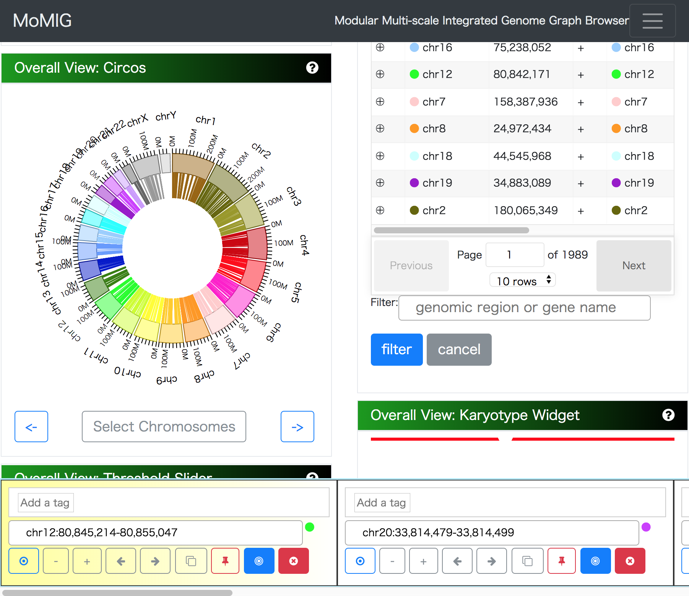
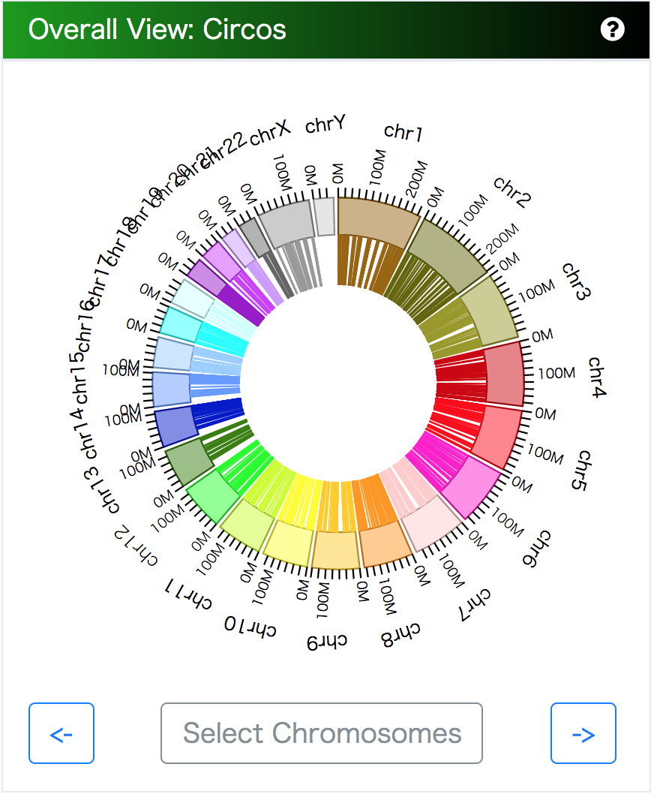
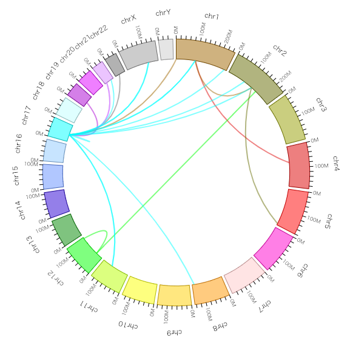
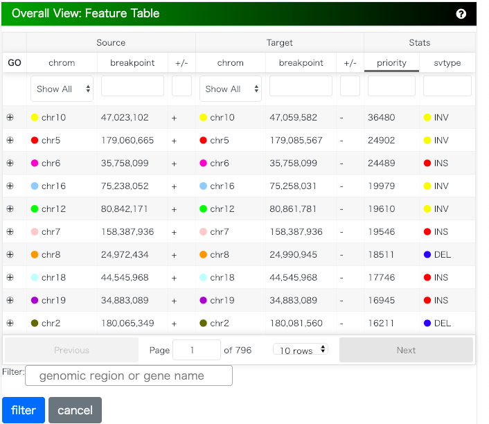
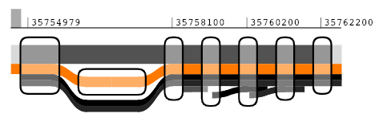

## MoMI-Gとは

> ### 構造変異（SV）
>
> 挿入（Insertion）
>
> 欠失（Deletion）
>
> 逆位（Inversion）
>
> 転座（Translocation）
>
> 

ロングリードのSV検出に使える可視化ツールである。

### Overall View

Overall Viewは以下の５つのビューから構成されている。
このモジュールで行うことは、詳細にSVを調べたい箇所の大まかなあたりをつけることである。調べたい領域を選択すると、[Workspace](#Workspace)にカードが追加され、より詳細な情報が[SequenceTubeMap](#Sequence Tube Map)上で見ることができる。

#### Circos Plot

Circosプロットは、染色体上の２座標間の対応関係を円状に配置された染色体間の線で表現する。染色体をクリックすると

これは染色体内（intra-chromosomal）でSVがある場合の図である。

 染色体間（inter-chromosomal）の場合は以下のようになる。

> 12番染色体（chr12）および、17番染色体（chr17）には一部染色体内のSVが見られることに注意。

#### Feature Table

入力したデータのSVの二座標間の対応関係を表形式で表している。染色体ごとの絞り込みや座標位置によるソートが可能。左端の`GO`の列をクリックすることで、[Workspace](#Workspace)にカードを追加することができる。

#### Threshold Filter

スライダーを左右に調節することで、SVの対応関係に設定された優先度（Priority）で、表示させるSVを絞り込むことができる。

また、`Inter-Chromosomal`および`Intra-Chromosomal`のチェックボックスを切り替えることで、染色体間と染色体内のSVで絞り込むことができる。

### Workspace

[Overall View](#Overall View)で選択された変異はこのWorkspaceにカードとして追加される。

追加されたカードのうち、一番左にあるものが[Graph Veiw](#Grapg View)および[Linear View](#Linear View)で表示される。

カードはドラッグで自由に並び替えることができる他、カードをダブルクリックすることで一番左に移動させることも可能である。

カードには種々のボタンがついており、カードのピン留、削除、任意のラベルをつける機能、表示している領域の拡大縮小および左右への移動が備わっている。

グラフの拡大縮小とは違う。

### Graph View

#### Sequence Tube Map

Workspaceの一番左端にあるカードに記された染色体上の領域が描画される。

もっとも大きな特徴は、SVが種類によって一目でわかるイラストで描画されている点である。
以下に例を示す。

* Deletion

* Insertion

* Inversion

* Duplication

これらのグラフに表示されている太く黒いまっすぐな線が、リファレンス配列を示しており、黒い枠線で囲まれた四角い領域をノードという。このノードは塩基配列に対応する配列を意味している。裏を返せば、ノードに含まれていない領域はただの絵に過ぎない。

したがって、SV毎のノードに含まれている領域は以下のようになる。

* 欠失→リファレンス配列のみ
* 挿入→サンプルの配列のみ
* 逆位→サンプルの配列が逆方向に
* 複製→サンプルの配列が二回

ドロップダウンメニューで切り替えることで、塩基配列を文字情報として表示させることができる。

次の図は、挿入の開始点を拡大した図である。

このようにノードはサンプルの配列と同じ箇所を示しているとも言える。

また、これらのグラフは、50,000bpより大きな粒度で指定した場合は表示されない。

### Linear View

#### AnnotationTable
Graph View で表示されている区間に存在する遺伝子のアノテーションについて、その詳細情報をテーブル形式の一覧で表示している。

